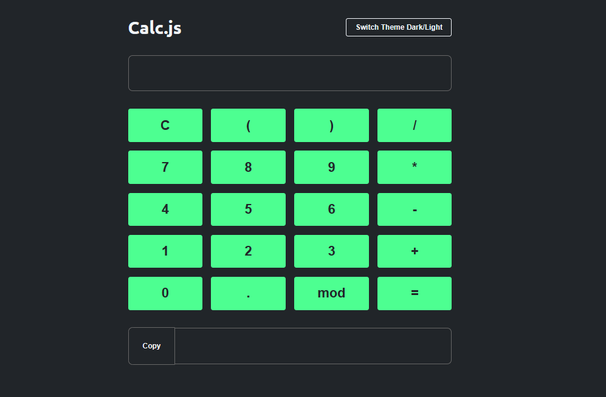

# calc.js

Calc.Js é uma calculadora feita através do curso de javascript da OneBitCODE

## Funcionalidades do projeto

O Calc.Js é uma calculadora de calculos simples, possuindo duas formas de escrita: pelos botões ou pelas teclas;
A calculadora tem um `<button>` com a utilidade de mudar a o tema da página e um `<button>` para copiar o resultado do calculo!

## ✔️ Técnicas e tecnologias utilizadas

- `HTML`: O HTML inseriu o elemento `<button>` que foi utilizado na página para fazer os botões clicáveis;
- `CSS`: O CSS foi utilizado para constumização da página dando uma aparência de calculadora;
- `JavaScript`: O JavaScript proporcionará programarmos a dinâmica do `<buttton>` deixando apenas as teclas numericas e sinais disponiveis para uso. Além do principal, fazer a calculadora calcular;
  - `querySelector`;
  - `document`;
  - `const`;
  - `function`;
  - `while`;
  - `for`;
  - `if`;
  - `else`;

## 📁 Acesso ao projeto

[Veja o projeto final do curso em funcionamento](https://projeto-pratico-calc-js.vercel.app).

